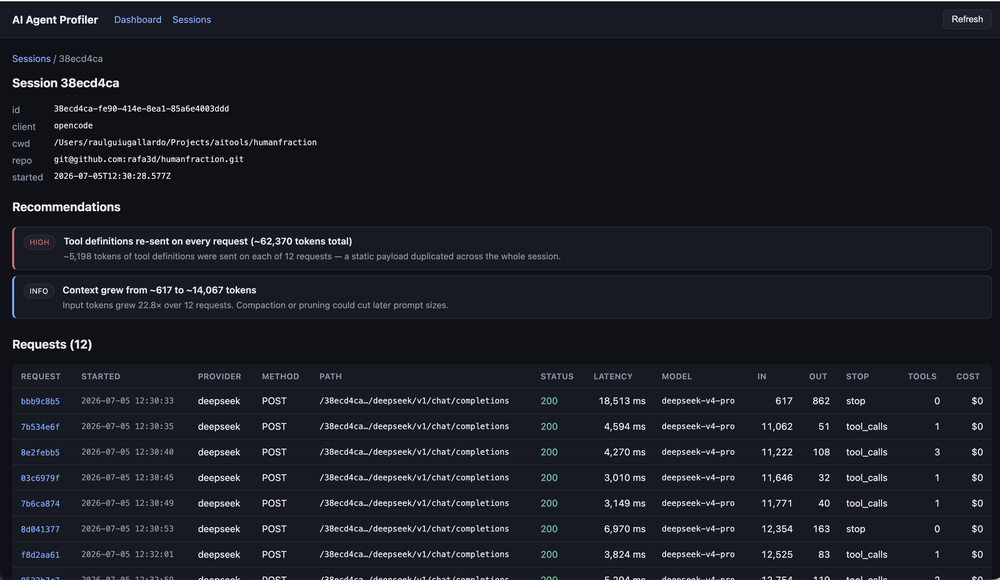
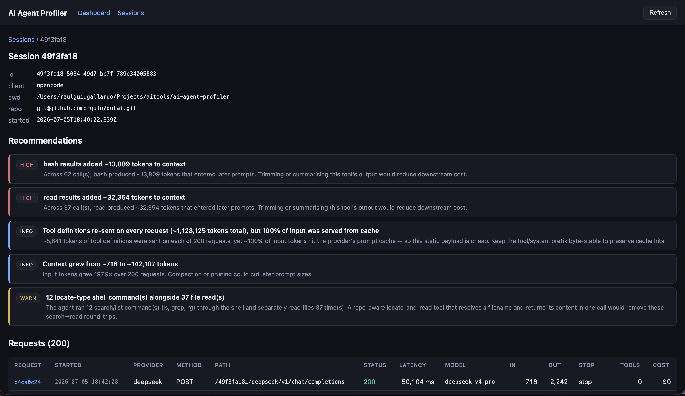

# AI Agent Profiler

A **local-first profiler and optimizer for AI coding agents** — read-only by default,
with an optional in-flight optimize layer that cuts token waste.

It sits as a transparent proxy between a coding agent (Claude Code, opencode) and an
LLM provider (Anthropic, OpenAI-compatible) and records high-fidelity traces of every
interaction — so you can measure how the agent uses tools, files, context, and models.

It is a **performance profiler for autonomous coding agents** — not an observability
dashboard, not an enterprise proxy. See [`VISION.md`](VISION.md).

On top of profiling, an optional [optimize layer](#optimize-layer) can rewrite requests
in-flight to cut token waste on long sessions. It's off by default. On our benchmark it
produced a large win on Claude/Bedrock (**~−75% cost**) but a **regression** on
DeepSeek — the effect is **provider-dependent**, driven by how each provider's prompt cache
reacts to editing old context. See the
[benchmark report](benchmarks/REPORT-optimize-layer.md) for the full, honest picture.

## How it works

Launch your agent through a small wrapper that points its provider base URL at the
profiler:

```
aap serve            # terminal 1: proxy + read API
aap run claude       # terminal 2: launch an agent (or: aap run opencode)
```

The profiler streams traffic through untouched, tees a copy to append-only trace files,
and indexes metadata in SQLite. Metrics are computed off the hot path so token streaming
stays unbuffered. See [`ARCHITECTURE.md`](ARCHITECTURE.md).

`aap run` is **not required** — the proxy is transparent, so any client pointed at it is
captured. What `aap run` adds is **attribution**: a stable session id, the working
directory + git repo, and per-session grouping for concurrent agents. Without it,
requests still land in an "unattributed" session. None of this metadata is ever sent to
the LLM.

## Features

- Transparent, byte-faithful HTTP(S) proxy — never modifies requests.
- Per-session raw trace capture (requests, responses, streaming, timing) with secret redaction.
- Token, latency, cost, and tool metrics derived from raw traces (`aap parse`).
- Read API + a dark-mode web dashboard at `/ui`.
- Insights: tool usage, repeated tool calls, context growth, tool-result **token
  amplification**, and **context composition** (system-prompt size, tool-definition
  tokens, duplicated totals).
- **Prompt-cache awareness** — captures provider cache-hit tokens so findings reflect real cost.
- **Message-stack breakdown** — per-request context split by role (system/user/assistant/tool).
- **Command-usage analysis** — which shell programs run through `bash`, how often, by category.
- **Recommendations** — actionable findings per session (repeated reads, redundant calls,
  high amplification, context duplication, inefficient search→read).
- **Export & compare** — session reports as Markdown/JSON; sessions side by side.
- **MCP server** (`aap mcp`) — 10 tools exposing the profiler's data for agent self-introspection.
- **Optimize layer** — 7 request-rewriting strategies (see below).

See [`ROADMAP.md`](ROADMAP.md) for what's next.

## Dashboard





## Installation

Not published yet — install from source. Requires **Node 20+**.

```
git clone <repo-url> ai-agent-profiler && cd ai-agent-profiler
npm install          # install dependencies
npm run build        # compile to dist/
npm link             # put the `aap` command on your PATH (or: npm install -g .)
```

`npm link` is a per-machine step. After pulling changes, re-run `npm run build`.

Then create your config where `aap` looks by default. The easiest way is the
installer, which seeds `~/.aap/config.toml` (from your `config.toml`, or
`config.example.toml`) and points storage at `~/.aap/data`:

```
./install.sh
```

Or do it by hand:

```
mkdir -p ~/.aap
cp config.example.toml ~/.aap/config.toml   # edit providers / pricing / storage.dir
```

`aap` resolves config in this order: `$AAP_CONFIG` → `~/.aap/config.toml` →
`./config.toml`.

> Tip: set `storage.dir` to an absolute path (e.g. `~/.aap/data`) so captured
> data lives in one place regardless of where you start `aap serve`.

## Usage

```
aap serve            # start the proxy + read API (prints a line per request)
aap run <agent>      # launch an agent through the profiler, e.g. aap run claude
                     #   tag a run: aap run --meta task=explain --meta iter=1 opencode
aap parse [--all]    # derive token/cost/tool metrics from captured traces
aap sessions         # list captured sessions (aap sessions rm <id> to delete)
aap commands         # break shell commands down by token cost
aap tag <id> k=v     # tag a session with metadata (e.g. verify=pass)
aap export <id>      # export a session report (Markdown; add --json for JSON)
aap compare <ids>    # compare sessions side by side (add --json for JSON)
aap optimize <id>    # dry-run: show which optimizations would fire + tokens saved
aap mcp              # start an MCP server (stdio) for agent self-introspection
aap config           # print the resolved configuration
```

Inspect captured data over HTTP (same port as the proxy):

```
GET /ui                        # web dashboard (also at /)
GET /stats                     # totals: sessions, requests, tokens, cost
GET /sessions                  # sessions with rolled-up metrics
GET /sessions/:id              # session detail with its requests + analysis
GET /requests/:id?events=1     # request detail + raw trace events
GET /requests/:id/messages     # per-message context breakdown (roles, sizes)
GET /tools                     # global tool-usage totals
GET /commands                  # shell-command breakdown (?session=<id> to scope)
GET /health
```

Open **`http://localhost:8080/ui`** for the dashboard.

### opencode + DeepSeek

DeepSeek is OpenAI-compatible. Add it — plus a pricing table so cost can be
computed — to your `aap` config:

```toml
[providers.deepseek]
upstream = "https://api.deepseek.com"

# Per-million-token rates (check current prices). Cost is null without this.
[pricing."deepseek-chat"]
inputPerMTok = 0.435
outputPerMTok = 0.87
```

Then launch opencode through the wrapper — no `opencode.json` edits needed:

```
aap serve                       # terminal 1
aap run opencode                # terminal 2, from your project
```

`aap run opencode` injects an `OPENCODE_CONFIG_CONTENT` that routes each configured
provider through the proxy. opencode still supplies the API key itself; the proxy only
forwards it and redacts it from stored traces. If a provider's base path isn't `/v1`,
set `apiPath` on its `[providers.<name>]` entry.

**Token & cost capture.** OpenAI-compatible providers omit the `usage` block from
streaming responses unless the request opts in, which otherwise leaves token counts —
and therefore cost — unrecoverable. The proxy automatically injects
`stream_options.include_usage` on streaming chat-completions for OpenAI-format
providers (`openai`, `deepseek`), so usage is recorded on **every** request,
independent of `--optimize`. Pricing lookup is tolerant of a `provider/` prefix and
case, so a reported model like `deepseek/deepseek-chat` still resolves to the
`deepseek-chat` table above. If usage is genuinely absent, tokens and cost stay `null`
(never faked as `$0`) so a broken capture is visible.

### Ollama (local proxy)

Ollama's CLI talks to a daemon over its native API. Point the profiler's Ollama
upstream at your **local Ollama daemon** on `127.0.0.1` — not `ollama.com` — so the
daemon handles model routing and (for cloud models) authentication:

```toml
[providers.ollama]
upstream = "http://127.0.0.1:11434"
```

Then start the daemon and launch through the wrapper:

```
ollama serve                    # local daemon on 127.0.0.1:11434
aap serve                       # terminal 1
aap run ollama                  # terminal 2 — pins the active ollama session
```

`aap run ollama` sets `OLLAMA_HOST` to the proxy and marks the session as the active
Ollama session, so `/api/...` traffic is attributed to it. This works for both local
models and cloud models (`*:cloud`) — the daemon relays cloud requests to `ollama.com`
and authenticates via `~/.ollama/id_ed25519`. Pointing the upstream directly at
`https://ollama.com` returns **401** (the CLI sends no cloud credentials to what it
treats as a local daemon). See [Ollama specifics](#ollama-specifics) below for
attribution and parsing caveats.

### Providers & known issues

`aap` redirects each agent's provider base URL through the proxy. How that redirect
works — and its caveats — differ per provider:

| Provider      | Routing                                                                                      | Known issues                                                                                                                                                                      |
| ------------- | -------------------------------------------------------------------------------------------- | --------------------------------------------------------------------------------------------------------------------------------------------------------------------------------- |
| **Anthropic** | `ANTHROPIC_BASE_URL` → `/<session>/anthropic`                                                | —                                                                                                                                                                                 |
| **OpenAI**    | `OPENAI_BASE_URL` → `/<session>/openai`                                                      | —                                                                                                                                                                                 |
| **DeepSeek**  | opencode only, via `OPENCODE_CONFIG_CONTENT`                                                 | Not routed for non-opencode agents (no base-URL env). Base path is `/v1`; set `apiPath` if different.                                                                             |
| **Bedrock**   | Host-based `/model/...` (no session prefix); attributed to the active `meta.bedrock` session | Requires SigV4 re-signing, so AWS creds / `AWS_PROFILE` must be available to `aap serve`. Concurrent Bedrock sessions can mis-attribute (routing is host-based, not per-session). |
| **Ollama**    | Host-based `/api/...` (native API); attributed to the active `meta.ollama` session           | See below.                                                                                                                                                                        |

#### Ollama specifics

- `OLLAMA_HOST` accepts only scheme+host+port (no path), so requests can't carry a
  `/<session>/` prefix. They're matched by the `/api/` path and attributed to the
  session started by `aap run ollama` — concurrent Ollama sessions can mis-attribute.
- The daemon streams newline-delimited JSON labelled `application/json` (not
  `x-ndjson`); `aap` detects and parses it. Token usage comes from
  `prompt_eval_count`/`eval_count`; Ollama reports no cache tokens.

### Self-introspection via MCP

`aap mcp` starts a stdio MCP server so an agent can query its own captured behaviour —
"which requests cost the most?", "which file did I read most often?". Add it to
`opencode.json`:

```json
{
  "mcp": {
    "aap": { "type": "local", "command": ["aap", "mcp"], "enabled": true }
  }
}
```

## Optimize Layer

An optional layer that rewrites request bodies in-flight to reduce token waste in long
sessions. Enable it with `--optimize` or in config:

```
aap serve --optimize
```

### Strategies

| Strategy           | Default | What it does                                                               |
| ------------------ | ------- | -------------------------------------------------------------------------- |
| `dedup`            | ON      | Returns a stub for identical repeated tool calls (unchanged file reads)    |
| `truncate`         | ON      | Head+tail truncation for results exceeding `truncateThreshold` bytes       |
| `stablePrefix`     | ON      | Canonicalises tool definitions for byte-stable prompt-cache hits           |
| `pruneStale`       | ON      | Replaces tool results older than `pruneAfterTurns` with 1-line summaries   |
| `suppressReread`   | ON      | Suppresses reads of files written within `suppressWithinTurns` turns       |
| `collapseSystem`   | ON      | Collapses repeated system prompts to a hash stub                           |
| `pruneUnusedTools` | ON      | Drops tool definitions never called after `pruneUnusedToolsAfter` requests |

### Configuration

All settings live under `[optimize]` in `config.toml`:

```toml
[optimize]
enabled = true              # always optimize (or use --optimize flag)
truncateThreshold = 4096    # bytes above which truncation kicks in
pruneAfterTurns = 6         # prune results older than N assistant turns
suppressWithinTurns = 2     # suppress re-reads within N turns of a write
```

The sweet spot is sessions with 20+ requests involving repeated file reads and iterative
fix/verify cycles. For short sessions (<10 requests) the optimizer has minimal effect.

### Inspecting what fired

A live optimized run records **which strategies fired** and how many tokens each saved,
per session. View them in the session report or the JSON/dashboard:

```
aap export <session-id>            # Markdown report — "Optimizations applied" table
aap export <session-id> --json     # machine-readable: the `optimize` array
```

The recorded totals reflect the strategies that actually ran on the live request path.
To explore what _would_ fire on an already-captured session — a what-if that replays the
captured (pre-optimization) requests without re-running the agent — use the dry-run
simulator:

```
aap optimize <session-id>          # simulation over the captured session
```

### Benchmark results

On the `iterative-fix-plus` fixture (9 planted bugs + 3 method stubs, ~50-request session),
the optimize layer's effect was **opposite on the two providers we tested** — same task,
same code, same strategies:

| Setup                 | Optimize vs baseline (cost) | Notes                         |
| --------------------- | --------------------------- | ----------------------------- |
| Claude Code / Bedrock | **−75%**                    | cache held; best task quality |
| OpenCode / DeepSeek   | **+491%**                   | cache broke; agent looped     |

The whole difference is one strategy — `pruneStale` — interacting with each provider's
prompt-cache format. It's cache-safe and load-bearing on Anthropic-format traffic (Claude)
but cache-hostile on OpenAI-format traffic (DeepSeek). These are **single-sample, work-in-
progress** numbers; trust the direction, not the decimals. Full analysis, control runs, and
caveats: [`benchmarks/REPORT-optimize-layer.md`](benchmarks/REPORT-optimize-layer.md).

## Benchmarks

`benchmarks/` contains a corpus of small, self-contained fixtures (each with a planted,
verifiable bug) and a runner that executes the same tasks through an agent, tagged for
profiling.

```
aap serve
./benchmarks/run.sh opencode --fixture task-queue
aap sessions           # find the runs
aap commands           # which shell commands cost the most
```

See [`benchmarks/README.md`](benchmarks/README.md).

## Development

Requires Node 20+.

```
npm install
npm run dev -- <command>   # run the CLI via tsx, e.g. npm run dev -- sessions
npm test                   # vitest
npm run typecheck          # tsc --noEmit
npm run lint               # eslint
npm run format             # prettier --write
npm run build              # compile to dist/
```

The proxy uses Node's native `http`/`https` for byte-faithful streaming; the SQLite index
uses `better-sqlite3`. Source is under `src/` (proxy, capture, store, parse, recommend,
api, ui, cli); the web dashboard is plain HTML/CSS/JS in `web/`.

## Documentation

- [`VISION.md`](VISION.md) — why the project exists.
- [`ARCHITECTURE.md`](ARCHITECTURE.md) — how it is designed and why.
- [`ROADMAP.md`](ROADMAP.md) — what is done and what comes next.
- [`benchmarks/README.md`](benchmarks/README.md) — the benchmark corpus and runner.
- [`benchmarks/REPORT-optimize-layer.md`](benchmarks/REPORT-optimize-layer.md) — full optimize-layer benchmark (DeepSeek vs Claude).

## License

[MIT](LICENSE) © Raul Guiu
